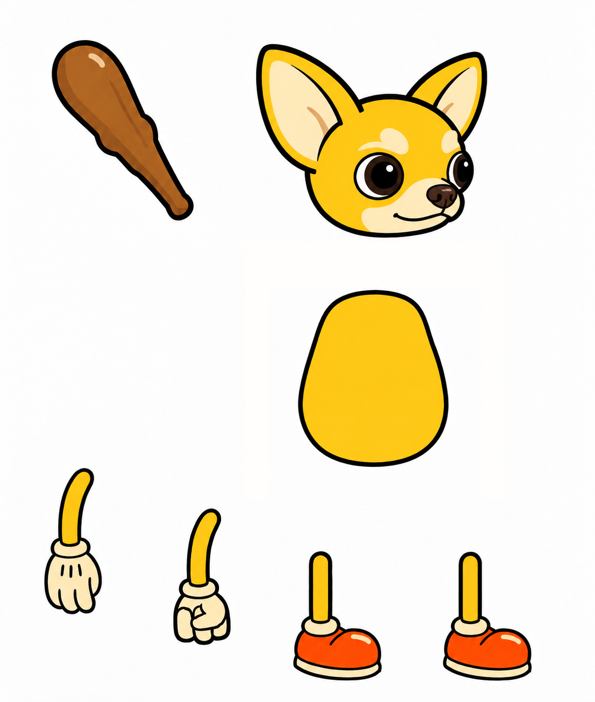

# 치와와 UI 아트 교체 작업 — 치와와 게임 UI 아트 교체 TODO / 다음 세션 인계

작성일: 2026-09-13. 저장소: `kuzuni/aaawunity`, 브랜치: `main`, Unity: `6000.3.8f1`.

> **최신 상태(2026-09-14 T519 완료):** 원래 인계 내용은 아래에 보존한다. 계획한 아트 제작·검수, 실제 카탈로그/런타임 연결, Unity 검사와 screens 직접 확인을 완료했다. 최종 근거는 [세션 기록](ChihuahuaGameUI-Sessions.md)과 `tools/game_ui_art/sessions/cloud-integration.md`에 있다.

## 먼저 알아야 할 상태

사용자의 마지막 요청은 대화 길이 한도 때문에 **현재 결과를 GitHub에 올리고 다음 GPT 세션이 이어서 끝낼 수 있게 TODO를 남기라**는 것이다. 따라서 이번 커밋은 중간 결과 보존이다. UI 리디자인 완료 커밋이 아니다.

- 이전 **T513 장비 아트 27세트는 완료**되어 main에 있다.
- **치와와 UI 아트 교체 작업은 T519에서 완료**했다. 아래 후보·조사 내용은 제작 전 인계 원문으로 보존한다.
- 후보 중 **5개는 실제 알파가 있는 RGBA PNG**, **천사·악마 2개는 체크무늬가 픽셀에 그려진 RGB 이미지**라 배경 수정이 필요하다.
- 이번 작업에서 런타임 C#, 카탈로그, 씬, 프리팹은 아직 변경하지 않았다. **현재 게임 화면은 새 이미지로 바뀌지 않았다.**
- 이미지 소스는 `tools/game_ui_art/checkpoint/`에 둔다. 아직 Unity에 연결하지 않은 중간 결과임을 명확히 하려고 `Assets` 밖에 보관했다. 다음 세션에서 준비된 최종 이미지를 `Assets/Art/ChihuahuaGameUI/`로 복사하고 `.meta`와 카탈로그를 연결한다.
- 이 세션의 lock은 남기지 않는다. 임시 T515는 업로드 도중 다른 세션의 장비 옵션 작업에 먼저 사용됐다. 아트 작업은 아직 PROGRESS/ROUTINE에 정식 등록하지 않았다. 다음 세션에서 최신 main 기준 `python3 tools/task_state.py --new-id`로 새 번호를 발급하고 이 TODO를 근거로 등록·선점한다. 기존 T515~T518의 다른 작업을 덮어쓰지 않는다.

## 사용자 지시와 그림체 — 반드시 유지

사용자는 **“야 치와와 캐릭터랑 그림체는 비슷해야함”을 두 번 강조**했다. 최초 상세한 판타지/실사 질감 시안은 이 지시와 맞지 않아 폐기했다. 그것을 최종 스타일로 되돌리지 않는다.

원본 기준 파일:

`Assets/Art/ChihuahuaEquipmentThemes/Reference/character_base.png`

- 노란 치와와, 크고 세운 귀, 둥근 얼굴, 크림색 눈썹·주둥이·귀 안쪽, 큰 갈색 눈, 갈색 코, 오른쪽을 보는 귀여운 얼굴의 정체성을 유지한다.
- **굵고 매끈한 검은 외곽선 / 둥글고 단순한 형태 / 밝고 단순한 색면 / 약한 명암 / 작은 크림색 하이라이트**가 기준이다. 원본의 몽둥이와 주황 신발 정도의 단순함을 따른다.
- 사실적인 나뭇결·금속 재질·붓터치·복잡한 애니풍 채색·얇거나 색깔 있는 외곽선·과한 빛 효과는 피한다.
- 아이콘도 같은 작가가 그린 것처럼 통일한다. 옵션 아이콘은 단색 흰색 기호가 아니라 부위를 알아볼 수 있는 컬러 그림이어야 한다.
- 내장 이미지 생성 도구를 사용하고 원본을 매번 스타일 참고로 첨부한다. 로컬 참고 이미지를 먼저 직접 본다. 별도의 유료 API/CLI로 임의 전환하지 않는다.
- 소품/아이콘은 실제 투명 알파 PNG, 여백을 포함해 잘리지 않은 전체 형태로 만든다. 파일명이나 프롬프트에 transparent라고 적혀 있는 것만으로 통과시키지 않는다.
- 사용자 승인: 새 이미지 생성, 프로젝트 적용, **main 커밋·푸시까지 이미 승인됨**. 이 작업 자체에 대한 재승인 요청은 필요 없다.
- UI 배치, 게임 수치·확률, 세이브 구조와 플레이어 위치 정책은 유지한다. 데이터 정본 `Assets/StreamingAssets/data/*.json`은 손으로 수정하지 않는다.

## 완료된 이전 작업 — 다시 만들지 말 것

T513 커밋: `bb5a87c5eb01ad36a14e0c59d621725921b64a35`.

경로: `Assets/Art/ChihuahuaEquipmentThemes/`.

- 9등급: 원시 / 중세 / 근대 / 현대 / 사이버 / 미래 / 우주 / 불멸 / 무한.
- 3직업: 도적 / 전사 / 암살자. 합계 27세트.
- 원본 리깅 PNG 27개, 실제 PSB v2 27개, 512×512 RGBA 부위 썸네일 162개.
- 모든 PSB는 1155×1362 캔버스, 위에서부터 **무기 / 머리 / 몸통 / 팔1 / 팔2 / 다리1 / 다리2 / 배경**의 8레이어. ID 1001–1008, 배경은 숨김.
- 원본 파츠 위치와 치와와 정체성 유지. 무기 폭은 자유이고 원본 몽둥이 **길이**만 맞추며 측정 오차는 2px 이하다.
- 썸네일: 모자·갑옷·반지·목걸이·귀걸이·무기. 갑옷과 무기는 리깅 원본에서 추출했고 장신구는 썸네일 전용이다.
- 본/웨이트 설정이나 실제 장비 런타임 연결까지 완료했다는 의미는 아니다. 이 작업은 소스 아트 납품 범위였다.
- 위 커밋의 CI run `34752650763`는 실제 Unity EditMode/PlayMode와 C# 검사를 포함해 통과한 것으로 이전 세션에서 확인했다. WebGL/Android 빌드는 워크플로 설계에 따라 건너뛰었다. 이를 치와와 UI 아트 교체 작업 검증 결과로 재사용하지 않는다.

## 보관한 새 이미지

공통: 1254×1254 원본 크기, 생성 파일 바이트 그대로 보존. SHA-256과 알파 정보는 `tools/game_ui_art/checkpoint/manifest.json`에 기록했다. 생성 프롬프트와 투명화 시도 기록은 같은 폴더의 `prompts.json`에 있다.

| 항목 | 저장소 상대 경로 | 실제 상태 | 다음 작업 |
|---|---|---|---|
| 중세 상자 닫힘 | `tools/game_ui_art/checkpoint/ready/chest_medieval_closed.png` | RGBA, 그림체 검수됨 | 열림 버전 제작, 크기·바닥선 맞춰 연결 |
| 현대 상자 닫힘 | `tools/game_ui_art/checkpoint/ready/chest_modern_closed.png` | RGBA, 그림체 검수됨 | 열림 버전 제작, 크기·바닥선 맞춰 연결 |
| 사이버 상자 닫힘 | `tools/game_ui_art/checkpoint/ready/chest_cyber_closed.png` | RGBA, 그림체 검수됨 | 열림 버전 제작, 크기·바닥선 맞춰 연결 |
| 파란 다이아 | `tools/game_ui_art/checkpoint/ready/diamond_blue.png` | RGBA, 그림체 검수됨 | `hud.gem` 및 팩/보상 연결 확인 |
| 쉼터 집 | `tools/game_ui_art/checkpoint/ready/shelter_house.png` | RGBA, 그림체 검수됨 | 월드 노드·팝업에 연결 |
| 악마 | `tools/game_ui_art/checkpoint/needs_alpha/devil_draft.png` | **RGB, 체크무늬 배경 포함** | 실제 알파로 수정 후 사용 |
| 천사 | `tools/game_ui_art/checkpoint/needs_alpha/angel_draft.png` | **RGB, 체크무늬 배경 포함** | 실제 알파로 수정 후 사용 |

`ready`는 투명 PNG 후보라는 뜻이며 게임 내 표시 검증까지 완료했다는 뜻이 아니다. 상자 3개의 보이는 크기와 바닥선, 작은 아이콘에서의 가독성은 실제 UI에 놓고 맞춰야 한다.

천사·악마는 투명화 전용 편집을 한 번 더 요청했지만 결과가 여전히 RGB였다. 파일명을 바꿔 알파가 된 것으로 처리하지 않는다. 보관한 시안의 얼굴·포즈·굵은 선을 유지하면서 내장 이미지 도구로 배경을 고치고 실제 알파 채널을 다시 확인한다.

## 남은 TODO — 제작 + 실제 게임 연결

- [x] 원본 치와와 스타일 기준 확정, 틀린 스타일 시안 제외.
- [x] 중세·현대·사이버 닫힌 상자, 파란 다이아, 쉼터 집 투명 PNG 후보 확보.
- [x] 천사·악마 그림체 후보 확보. 배경 문제를 명시하고 원본 보관.
- [x] 천사·악마 실제 투명 PNG 수정. 쉼터·악마·천사를 전투 월드와 해당 팝업 양쪽에 적용.
- [x] 중세·현대·사이버 상자 **열림 3종** 제작. 닫힘/열림의 몸체 크기·위치·바닥선을 일치시켜 상점 및 열기 팝업에 적용.
- [x] 파란 다이아를 재화 표시·상점·아레나 상점·보상에 일관되게 적용. `shop.gem.1`~`shop.gem.6` 묶음 이미지도 검토.
- [x] 공격력·공격속도·방어력·치명타 확률/피해·반격·회피·흡혈·경험치·체력·쉴드 등 **옵션 컬러 아이콘** 제작 및 실제 소비처 연결. 기존 tint 때문에 색이 망가지거나 흰색이 되지 않게 확인.
- [x] `SampleImage_Map`을 챕터 테마별 이미지로 교체. 실제 순서는 `autumn → deepForest → forest → desert`, 4개 반복이다. 로비에서 선택한 챕터 변경 시 그림도 갱신.
- [x] 던전 카드 썸네일 2종: **원정 = 고대 유적**, **지옥의 문 = 지옥**.
- [x] 원정 전투 맵의 고대 유적 props·바닥·길 제작 및 던전 키 분기로 연결. 기존 숲 소품 색칠만으로 대체하지 않는다.
- [x] 지옥의 문 전투 맵의 지옥 props·바닥·길 제작 및 연결. 일반 사막으로 남기지 않는다.
- [x] 프로필 선택 이미지 **9개**를 동일 치와와 얼굴의 테마 변형으로 제작. 선택 수·저장 인덱스·키는 유지.
- [x] 방랑자의 보상(패스) 팝업 상단 배너: **모험하는 원본 치와와**. 제목·기간·레벨 표시가 잘 읽히도록 여백 확보.
- [x] 로딩 화면도 같은 치와와로 변경. 로딩 진행바·최소 표시시간·진행 문구 유지.
- [x] 움직이는 배경 패턴을 **강아지 발바닥과 뼈다귀**로 교체. 타일 경계가 이어지고 기존 반복·이동이 계속 작동하게 확인.
- [x] 아레나 입구 카드/배너·순위 행 관련 임시 그림을 새 디자인으로 교체. 순위·이름·점수와 기존 배치 유지.
- [x] 아레나 상점 배너의 임시 카운터·상인 합성 그림을 같은 그림체의 새 배너로 교체.
- [x] 부위별 도안 6종: **무기 / 갑옷 / 투구 / 신발 / 반지 / 목걸이**를 서로 알아볼 수 있는 그림으로 제작. 랜덤 도안용 일반 이미지도 별도 판단.
- [x] 최종 이미지를 `Assets/Art/ChihuahuaGameUI/`에 배치하고 `.meta`, 카탈로그와 런타임 연결 완료.
- [x] 아래 검증 완료 후 main 커밋·푸시. 실제 CI 및 화면 검수 결과를 PROGRESS에 기록하고 치와와 UI 아트 교체 작업 완료 처리.

## 이미 조사한 코드 위치

이 내용은 마지막 확인 main `b02e72b758c828a21a66e8bbed0db719599ffae0` 기준이다. 새 main 변경을 먼저 확인하고 다른 세션 작업을 보존한다.

| 영역 | 파일 / 키 | 연결 시 주의점 |
|---|---|---|
| 중앙 카탈로그 | `Assets/KkomaKnight/catalog.json` | `tools/gen_catalog.py`가 `AssetCatalog.asset`과 `docs/assets-map.md` 생성. 런타임 키를 새 경로에 매핑해야 실제 적용된다. |
| 상점 상자 | `Assets/Scripts/Game/ShopScreen.cs` | `BuildBigCard`/`BuildSmallCard`는 `chest.` + box.Key. `rare`=중세, `legend`=현대, `myth`=사이버. `.open`도 교체. 열기 팝업 `Image_Chest` 사용. |
| 다이아 | `hud.gem`, `shop.gem.1`~`6`, `EventsScreen.Goods`/`RewardArt` | 다른 세션 **T514**가 아레나 재화도 `hud.gem`으로 통일했다. 이 수정은 보존. `ui.iconGemPurple`의 일부 사용은 재화가 아닌 랭크 티어 그림이다. |
| 능력치 | `Assets/Scripts/Game/Palette.cs`의 `Icons.Stat` | 아래 11개 키 매핑과 실제 화면 소비처를 함께 확인. |
| 이미지 tint | `Assets/Scripts/Game/UiKit.cs`의 `Icon`/`SetSprite` | 기존 tint를 그대로 곱하면 새 컬러 그림이 변색된다. 새 컬러 아이콘에 한정해 RGB white + 원래 alpha 처리 등 검토. 모든 UI 틴트를 무작정 제거하지 않는다. |
| 월드 테마 | `Assets/Scripts/Game/BattleWorld.cs`의 `Theme` | 현재 Arena 또는 `ForChapter` 선택. 던전 키 `hell`, `expedition`으로 별도 테마 선택 필요. `BattleScreen.DungeonKey`, `App.StartBattle` 참고. |
| 월드 바닥/길/소품 | `BattleWorld.BuildGround`/`BuildProps`, `MapLayouts.cs` | `MapLayouts.cs`는 생성 파일이므로 직접 덮어쓰지 않는다. 별도 던전 레이아웃/테마 경로 설계. 기존 바닥은 128px 기준 스케일이므로 큰 PNG에 같은 scale을 그대로 적용하지 말고 PPU/월드 크기 확인. |
| 월드 쉼터/악마/천사 | `BattleWorld.BuildNodes` | 현재 쉼터=통·버섯, 악마=비석·죽은 나무, 천사=돌 합성. 새 실제 그림으로 연결. 노드 좌표·기능 유지. |
| 관련 팝업 | `Assets/Scripts/Game/Overlay.cs` | Rest/Devil/Angel 그림도 함께 바꾼다. 천사 팝업의 `pi.wing` 등 기존 단색 그림 확인. |
| 챕터 지도 | `Assets/Scripts/Game/Screens.cs`의 Lobby | `SampleImage_Map`을 찾아 `CardMapImage`로 재배치. `_mapImage` 참조를 유지해 선택 챕터 Refresh에서 교체하도록 검토. 기존 원본 573×709 세로 지도. |
| 프로필 | `Profile.Faces`, `Profile.Icons` | Faces=9개(`ui.iconFoe1`~`4`, `ui.face5`~`9`). Icons=4개는 더미 랭커 계산에 사용. 배열 길이/저장 데이터 구조 변경 없이 이미지 교체. |
| 패스 | `Assets/Scripts/Game/SeasonPassScreen.cs`의 `BuildBanner` | `PanelBanner` 영역에 배너 추가. 기존 PassName/SeasonEnds/LevelBadge 텍스트가 가려지지 않아야 한다. |
| 로딩 | `LoadingScreen.Show`, `ui.titleLoading` | 전역 `UiKit.Cat` 준비 전이므로 전달받은 cat을 사용. 기존 프리팹 자식 이미지 구조를 먼저 읽고 교체. |
| 패턴 | `UiKit.PatternKey = ui.pattern`, `UiKit.HasPattern` | RawImage 반복 UV와 DOTween 이동 사용. `HasPattern`이 현재 `Pattern_01` 텍스처명에 의존해 새 파일명에서 누락될 수 있다. 로비 합성 셰이더 소비처도 확인. Repeat importer 필요. |
| 던전 카드 | `Assets/Scripts/Game/EventsScreen.cs`의 `BuildDungeon` | `Pic`+`Stage()` 임시 소품 합성 대신 원정/지옥 썸네일. 제목·티켓·버튼·보상 유지. |
| 아레나 | `EventsScreen.BuildPvp`/`BuildArena`/`Banner` | 입구 카드의 사막 합성, 무대의 카펫·기둥·횃불, Social_Ranking 프리팹의 Cloth/Name/Trophy 위치를 조사한 상태. 실제 배너/행 범위를 화면으로 확인 후 교체. |
| 아레나 상점 | `EventsScreen.BuildMerchant` | 카운터·동전·상자·통·상인 파츠 합성 배너를 새 배너로 교체. 상품 데이터 유지. |
| 도안 | `Assets/Scripts/Core/Recipes.cs` | `Icon(part)`가 모두 `IconKey=ui.iconScroll`을 반환한다. 부위별 키로 분기해야 한다. Core에 UnityEngine 참조 금지. |
| 도안 소비처 | `EventsScreen.Goods`, `LobbyPopups`, 보상/패스 | 상품에 박힌 `ui.iconScroll`을 부위별 `Recipes.Icon(...)`으로 연결. 랜덤 도안은 일반 이미지 의미 유지. 기존 부위 키를 확인하고 매핑. |

능력치 매핑(현재):

| 옵션 | 현재 그림 키 |
|---|---|
| dmg 공격력 | `pi.attack` |
| def 방어력 | `pi.defense` |
| aspd 공격속도 | `pi.atk_spd` |
| counter 반격 | `pi.fist` |
| critR 치명타 확률 | `pi.critical` |
| evade 회피 | `ui.dodge` |
| critF 치명타 피해 | `pi.damage` |
| steal 흡혈 | `pi.drop` |
| hp 체력 | `pi.heart` |
| sh 쉴드 | `pi.shield` |
| exp 경험치 | `pi.star` |

`Icons.Perk`는 주로 `PerkArtwork.Key(id)`의 별도 PNG를 쓴다. 해당 89개 그림은 아직 직접 검수하지 않았으므로 모두 흰색이라거나 전부 교체했다고 가정하지 않는다. 사용자 요청한 옵션의 실제 소비처를 확인한다.

## 작업 환경 / 재개 순서

1. 최신 main을 읽고 `TODO.md`와 이 문서를 확인한다. 이 아트 작업은 미완료이며 다음 세션에서 새 번호로 등록해야 한다. 살아 있는 다른 세션의 lock이 있다면 저장소 규약을 따른다.
2. 원본 치와와와 보관한 7개 PNG를 직접 본다. `manifest.json`으로 실제 파일·모드·SHA를 확인한다.
3. 새 작업 번호를 발급·등록·선점해 PROGRESS 상태·SID·범위를 갱신하고 lock을 push한 다음 제작/런타임 변경을 시작한다. 90분 안에 갱신한다.
4. 천사·악마 알파와 상자 열림을 먼저 해결한 뒤, TODO의 나머지 아트를 순서대로 제작하고 실제 화면에 연결한다. 새 결과는 생성 직후 저장소 작업 폴더에 복사하고 프롬프트/검증 기록을 갱신한다.
5. 준비된 이미지 파일을 추가하는 것과 게임에서 사용하는 것은 별개다. 카탈로그 키 및 코드 참조까지 완료하고 실제 화면을 검수한다.

이전 작업 폴더는 `/workspace/scratch/9fc4baf5fd9a/aaawunity-work`였으나 다음 세션에 남아 있다고 가정하지 않는다. 필요한 결과는 이번 체크포인트에 모두 담는다.

해당 clone은 **sparse checkout**이었다. `Assets/Scripts`, `Assets/Tests`, `Assets/StreamingAssets`, `Assets/KkomaKnight`, 원본 캐릭터 reference와 모든 `.meta` 위주로 받았고, 큰 원본 에셋 상당수는 작업 트리에 없다.

- sparse 상태에서 **`tools/gen_meta.py`를 수정 모드로 전체 실행하면 안 된다**. 누락된 원본 파일의 `.meta`를 고아로 오인해 지울 수 있다. 새 폴더에만 `gen_meta.guid/body` 방식으로 생성하거나 필요한 원본을 먼저 materialize한다.
- 전체 meta 검사와 `gen_catalog.py`는 원본 프리팹/기반 프리팹/오디오 등이 실제로 있어야 정확히 동작한다. DOTween 등 빌드 의존 파일도 필요하다.
- 새 세션에서는 네트워크·용량에 맞게 완전한 clone 또는 필요한 파일의 안전한 sparse 확장을 선택한다. 현재 도구의 검사 로직을 우회하도록 고치지 않는다.
- shallow main이 merge 커밋이면 무제한 fetch가 큰 과거 이력을 받을 수 있다. `git fetch --depth=1 origin main` 등 필요한 범위부터 확인한다.
- 이전 환경의 dotnet 8 SDK는 scratch의 `tmp/dotnet/dotnet`에 설치됐었다. 유지 여부를 확인하고 필요하면 환경에 맞춰 복구한다.
- Git CLI push 인증이 없을 때는 연결된 GitHub 도구의 blob/tree/commit/ref 기능을 사용했다. 항상 최신 main 기반, `force:false`로 다른 세션 변경을 보존한다. T514의 다이아 통일은 이미 main에 있으며 되돌리지 않는다.

## 검증과 완료 기준

이번 체크포인트는 **새 UI 코드 0줄, 카탈로그 변경 0줄, `Assets` 변경 0개**다. 이미지 바이트·알파·파일 연결과 문서 상태를 검증할 수 있지만 새 화면/플레이 검증은 아직 할 대상이 없다. 이 커밋의 검사를 UI 교체 전체 완료 증거로 쓰지 않는다.

다음 구현 단계에서:

- PNG 알파/해상도/여백, 전후 상자 크기, 부위별 도안 구분, 원본 치와와 얼굴/그림체를 직접 확인한다.
- `.meta` 누락·GUID 중복·카탈로그 경로/키를 검사하고 `gen_catalog.py`의 생성물을 갱신한다.
- 프로젝트 규약의 `dotnet build`, `dotnet test`, 메타/카탈로그 및 관련 정적 게이트를 실행한다. 로컬 VSTest 실행기 오류가 나면 통과로 쓰지 않고 실제 CI 결과를 기다린다.
- 값·이름·오브젝트 키를 바꾸면 `check_stale_asserts.py`와 관련 PlayMode 검사를 함께 확인한다. 옛 도안 공통 키나 Pattern_01 문자열에 의존하는 검사가 남을 수 있다.
- 실제 Unity EditMode/PlayMode 테스트 수와 `PlayLog.AssertNoRed`를 확인한다. 컴파일 실패나 실행 0개를 플레이 에러 없음으로 쓰지 않는다.
- 챕터 4테마, 던전 2종, 상점 상자 닫힘/열림, 다이아, 능력치/옵션, 프로필 선택, 패스, 로딩, 움직이는 패턴, 아레나·상점, 도안이 **실제 화면에서 새 그림을 쓰는지** 캡처로 확인한다.
- 정상 CI/화면 검증 후 PROGRESS에 결과와 커밋/런을 기록한다. 그때 해당 작업을 완료 처리하고 lock을 반납한다.

## 새 세션에 보낼 요청

> kuzuni/aaawunity main의 TODO.md와 docs/TODO-ChihuahuaGameUI.md를 읽고 치와와 UI 아트 교체 작업을 이어서 완료해줘. 저장된 이미지 7개부터 확인하고 원본 치와와와 같은 그림체를 유지해. 남은 제작, 실제 Unity 연결, 테스트와 main 커밋·푸시까지 진행해. 이 작업의 승인은 이미 했어.

## 업로드 직전 다른 세션 변경 보존

main이 `07fad4edb2d93279dccaf1d81db3628480c557a4`로 진행됐고 T515~T518은 다른 작업에 사용됐다. 그 커밋의 장비 옵션 최대 2개 등 변경을 그대로 보존한다. 이번 인계는 루트 TODO, 상세 TODO, 이미지·프롬프트만 추가하며 거대한 기존 PROGRESS/ROUTINE 문서는 이전 버전으로 덮어쓰지 않는다. 다음 세션은 새 작업 번호로 이 TODO를 등록한다.
