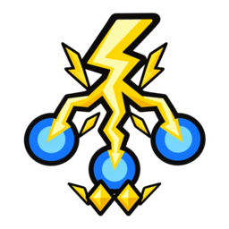
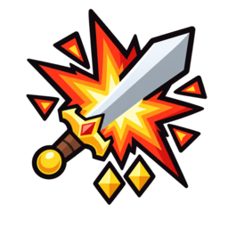
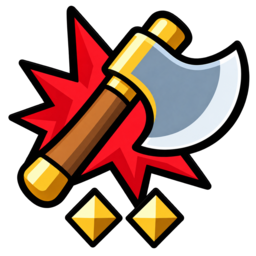
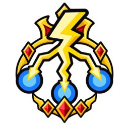
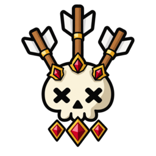
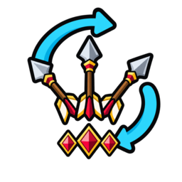
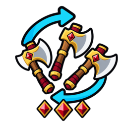
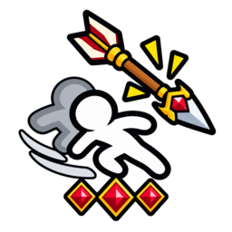

# 특전 100개 · 고유 GPT 아이콘 100종

기존 게임 그림체를 참고해 생성한 기본 효과 그림 59종과 추가 변형 41종을 사용한다. 이제 같은 효과의 등급별 특전도 서로 다른 스프라이트에 연결된다. 수치·확률만 증가하면 기존 발동 기호를 유지하면서 형태와 장식으로 구분하고, 실제 투사체 수가 늘면 그림의 화살·도끼·번개 수도 맞춘다.

기존 리깅 캐릭터, 애니메이션, 카드 배치와 밸런스 데이터는 유지한다.

## 파일과 연결

- `perk-icon-map.json`의 `perks`: 실제 특전 ID 100개와 고유 키·PNG 경로의 연결표. `families`는 59개 효과 계열과 집계용 기본 그림을 설명한다.
- `perk-icon-prompts.json`: 기본 59종의 그림체·레퍼런스·주제.
- `perk-icon-variants.json`: 추가 41종의 효과 설명·기준 그림·최종 생성 프롬프트.
- `Assets/KkomaKnight/PerkIcons/`: 256×256 투명 RGBA PNG.
- `PerkArtwork.Key`와 생성된 `AssetCatalog.asset`: 카드·특전 목록·전투 출처가 사용하는 스프라이트.
- `PerkIconMapTests`: 모든 특전이 실제 임포트된 서로 다른 스프라이트를 읽는지 검사.

다음 수정도 ChatGPT의 이미지 생성으로 해당 PNG만 교체하고 `.meta` GUID를 유지하면 된다. 새 그림 경로와 키를 추가했다면 `python3 tools/gen_meta.py` 및 `python3 tools/gen_catalog.py`를 실행한다.

## 전체 목록

| 그림 | 등급 · 특전 | 실제 효과 | ID |
|---|---|---|---|
|  | 일반 · 회피 시 회복 | 회피 시 33% 확률로 최대 체력 12% 회복 | `p_evadeHeal` |
|  | 일반 · 공격력 증가 | 공격력 +15% | `p_atk` |
|  | 일반 · 회피율 증가 | 회피율 +8 | `p_evade` |
|  | 일반 · 회피 시 화살 | 회피 시 33% 확률로 화살 1개 (공격력의 30%) | `p_arrowEv` |
|  | 일반 · 피격 시 도끼 | 피격 시 33% 확률로 도끼 1개 (공격력의 50%) | `p_axeHit` |
|  | 일반 · 반격률 증가 | 반격률 +8 | `p_counter` |
|  | 일반 · 반격 시 창 | 반격 시 창 1개 (공격력의 100% · 8마리 관통) | `p_spearCt` |
|  | 일반 · 치명타 확률 증가 | 치명타 확률 +8 | `p_critR` |
|  | 일반 · 치명타 피해 증가 | 치명타 피해 +30 | `p_critF` |
|  | 일반 · 방어력 증가 | 방어력 +8% | `p_def` |
|  | 일반 · 처치 시 창 | 처치 시 33% 확률로 창 1개 (공격력의 100% · 8마리 관통) | `p_killSpearN` |
|  | 일반 · 처치 시 번개 | 처치 시 33% 확률로 보이는 적 전부에게 번개 1회씩 (공격력의 75%) | `p_killBoltN` |
|  | 일반 · 처치 시 화살 | 처치 시 33% 확률로 화살 3개 (공격력의 30%) | `p_killArrowN` |
|  | 일반 · 처치 시 도끼 | 처치 시 33% 확률로 도끼 2개 (공격력의 50%) | `p_killAxeN` |
|  | 일반 · 가시갑옷 | 가시갑옷 +100% | `p_thornsN` |
|  | 일반 · 처치 시 회피 버프 | 처치 시 2초간 회피율 +40 | `p_killEvBuff` |
|  | 일반 · 수집가·공격 | 보유 특전 하나당 공격력 +4% | `p_collAtk` |
|  | 일반 · 수집가·치명 | 보유 특전 하나당 치명타 확률 +2 | `p_collCrit` |
|  | 일반 · 처치 시 공격력 스택 | 처치 시 33% 확률로 공격력 +1%(이 판 동안 누적) | `p_killAtkStk` |
|  | 일반 · 처치 시 회피 스택 | 처치 시 33% 확률로 회피율 +1(이 판 동안 누적) | `p_killEvStk` |
|  | 일반 · 처치 시 회복 | 처치 시 33% 확률로 최대 체력 6% 회복 | `p_killHealN` |
|  | 일반 · 수집가·체력 | 보유 특전 하나당 최대 체력 +7% | `p_collHp` |
|  | 일반 · 치명 스택 | 평타 적중마다 치명타 확률 +1(치명타 시 초기화) | `p_critStack` |
|  | 일반 · 공격 시 공속 버프 | 공격 시 공격속도 +7% 7초(중첩) | `p_aspdAtk` |
|  | 일반 · 회피 시 즉사 | 회피 시 5% 확률로 그 적 즉사 | `p_execEvN` |
|  | 일반 · 치명타 시 스턴 | 치명타 시 10% 확률로 3초 스턴 | `p_stunCritN` |
|  | 일반 · 2타 화살 | 2타마다 무작위 적에게 화살 1개 (공격력의 30%) | `p_nArrowN` |
|  | 일반 · 3타 도끼 | 3타마다 무작위 적에게 도끼 1개 (공격력의 50%) | `p_nAxeN` |
|  | 일반 · 3타 번개 | 3타마다 무작위 적에게 번개 1회 (공격력의 75%) | `p_nBoltN` |
|  | 일반 · 5타 회복 | 5타마다 최대 체력 6% 회복 | `p_nHealN` |
|  | 일반 · 회피 시 스턴 | 회피 시 30% 확률로 공격한 적 3초 스턴 | `p_evadeStun` |
|  | 일반 · 반격 치명 | 반격 시 치명타 확률 +20 | `p_ctCritN` |
|  | 일반 · 반격 강화 | 반격 데미지 +30% | `p_ctDmgN` |
|  | 일반 · 처치 시 확정 치명 | 처치 시 다음 공격은 반드시 치명타 | `p_killSureCrit` |
|  | 일반 · 관통 베기 | 공격 시 33% 확률로 바로 뒤 적도 같은 데미지 | `p_cleaveN` |
|  | 일반 · 피해 무시 | 피격 시 20% 확률로 그 피격 데미지 무시 | `p_ignoreN` |
|  | 일반 · 실드 없을 때 공격력 | 실드가 0 인 동안 공격력 +50% | `p_noShAtk` |
|  | 일반 · 실드 없을 때 공속 | 실드가 0 인 동안 공격속도 +30% | `p_noShAspd` |
|  | 일반 · 피격 시 방어막 | 피격 시 10% 확률로 방어막 1장 | `p_wardHitN` |
|  | 희귀 · 풀피 적 강타 | 체력이 가득 찬 적 공격 시 데미지 +100% | `p_fullHp` |
|  | 희귀 · 수리 증폭 | 실드 수리량 +100% | `p_repairUp` |
|  | 희귀 · 회복 증폭 | 체력 회복량 +100% | `p_healUp` |
|  | 희귀 · 가시갑옷 | 가시갑옷 +200% | `p_thornsR` |
|  | 희귀 · 처치 시 창 | 처치 시 66% 확률로 창 1개 (공격력의 100% · 8마리 관통) | `p_killSpearR` |
|  | 희귀 · 처치 시 번개 | 처치 시 66% 확률로 보이는 적 전부에게 번개 1회씩 (공격력의 75%) | `p_killBoltR` |
|  | 희귀 · 처치 시 화살 | 처치 시 66% 확률로 화살 3개 (공격력의 30%) | `p_killArrowR` |
|  | 희귀 · 처치 시 도끼 | 처치 시 66% 확률로 도끼 2개 (공격력의 50%) | `p_killAxeR` |
|  | 희귀 · 회복 시 수리 | 체력 회복 시 같은 양만큼 실드 수리 | `p_healRepair` |
|  | 희귀 · 처치 시 수리 | 처치 시 66% 확률로 최대 실드 6% 수리 | `p_killRepair` |
|  | 희귀 · 치명타 피해 증가 II | 치명타 피해 +60 | `p_critFR` |
|  | 희귀 · 회피 시 즉사 II | 회피 시 10% 확률로 그 적 즉사 | `p_execEvR` |
|  | 희귀 · 치명타 시 스턴 II | 치명타 시 20% 확률로 3초 스턴 | `p_stunCritR` |
|  | 희귀 · 2타 화살 II | 2타마다 무작위 적에게 화살 2개 (공격력의 30%) | `p_nArrowR` |
|  | 희귀 · 3타 도끼 II | 3타마다 무작위 적에게 도끼 2개 (공격력의 50%) | `p_nAxeR` |
|  | 희귀 · 3타 번개 II | 3타마다 무작위 적에게 번개 2회 (공격력의 75%) | `p_nBoltR` |
|  | 희귀 · 치명타 확률 증가 II | 치명타 확률 +16 | `p_critRR` |
|  | 희귀 · 반격률 증가 II | 반격률 +16 | `p_counterR` |
|  | 희귀 · 공격력 증가 II | 공격력 +30% | `p_atkR` |
|  | 희귀 · 회피율 증가 II | 회피율 +16 | `p_evadeR` |
|  | 희귀 · 처치 시 대시 | 처치 시 같은 웨이브의 다음 적까지 대시 | `p_killDash` |
|  | 희귀 · 버서커 | 처치 시 스택 1 · 평타마다 1 소모하고 그 공격 +100% | `p_berserkStk` |
|  | 희귀 · 반격 치명 II | 반격 시 치명타 확률 +40 | `p_ctCritR` |
|  | 희귀 · 반격 강화 II | 반격 데미지 +60% | `p_ctDmgR` |
|  | 희귀 · 관통 베기 II | 공격 시 66% 확률로 바로 뒤 적도 같은 데미지 | `p_cleaveR` |
|  | 희귀 · 회피 시 화살 II | 회피 시 66% 확률로 화살 1개 (공격력의 30%) | `p_arrowEvR` |
|  | 희귀 · 피격 시 도끼 II | 피격 시 66% 확률로 도끼 1개 (공격력의 50%) | `p_axeHitR` |
|  | 희귀 · 회피 시 회복 II | 회피 시 66% 확률로 최대 체력 12% 회복 | `p_evHealR` |
|  | 희귀 · 회피 시 수리 | 회피 시 15% 확률로 최대 실드 6% 수리 | `p_evRepairR` |
|  | 희귀 · 방어력 증가 II | 방어력 +16% | `p_defR` |
|  | 희귀 · 피격 시 방어막 II | 피격 시 20% 확률로 방어막 1장 | `p_wardHitR` |
|  | 희귀 · 치명 시 창 | 치명타 시 33% 확률로 창 1개 (공격력의 100% · 8마리 관통) | `p_critSpearR` |
|  | 전설 · 처치 시 창 | 처치 시 창 1개 (공격력의 100% · 8마리 관통) | `p_killSpearL` |
|  | 전설 · 처치 시 번개 | 처치 시 보이는 적 전부에게 번개 1회씩 (공격력의 75%) | `p_killBoltL` |
|  | 전설 · 오버킬 회복 | 처치 시 남은 데미지만큼 체력 회복 | `p_overkill` |
|  | 전설 · 처치 시 화살 | 처치 시 화살 3개 (공격력의 30%) | `p_killArrowL` |
|  | 전설 · 처치 시 도끼 | 처치 시 도끼 2개 (공격력의 50%) | `p_killAxeL` |
|  | 전설 · 광전사 | 공격력 300% 가 되는 대신 치명타 확률 0% | `p_berserk` |
|  | 전설 · 귀족의 눈 | 다음 특전부터 최소 희귀 이상만 나온다 | `p_nobleEye` |
|  | 전설 · 창의 화신 | 내가 쏘는 모든 화살이 창으로 바뀐다 (창 · 공격력의 100%) | `p_spearAvatar` |
|  | 전설 · 가시갑옷 | 가시갑옷 +300% | `p_thornsL` |
|  | 전설 · 거인의 힘 | 공격력 +200% 대신 공격속도 2/3 | `p_giant` |
|  | 전설 · 회피 시 즉사 III | 회피 시 15% 확률로 그 적 즉사 | `p_execEvL` |
|  | 전설 · 치명타 시 스턴 III | 치명타 시 30% 확률로 3초 스턴 | `p_stunCritL` |
|  | 전설 · 2타 화살 III | 2타마다 무작위 적에게 화살 3개 (공격력의 30%) | `p_nArrowL` |
|  | 전설 · 3타 도끼 III | 3타마다 무작위 적에게 도끼 3개 (공격력의 50%) | `p_nAxeL` |
|  | 전설 · 3타 번개 III | 3타마다 무작위 적에게 번개 3회 (공격력의 75%) | `p_nBoltL` |
|  | 전설 · 3타 창 | 3타마다 창 1개 (공격력의 100% · 8마리 관통) | `p_nSpearL` |
|  | 전설 · 관통 베기 III | 공격 시 바로 뒤 적도 같은 데미지 | `p_cleaveL` |
|  | 전설 · 치명 시 창 | 치명타 시 66% 확률로 창 1개 (공격력의 100% · 8마리 관통) | `p_critSpearL` |
|  | 전설 · 치명 시 번개 | 치명타 시 66% 확률로 보이는 적 전부에게 번개 1회씩 (공격력의 75%) | `p_critBoltL` |
|  | 전설 · 회피 시 화살 III | 회피 시 화살 1개 (공격력의 30%) | `p_arrowEvL` |
|  | 전설 · 피격 시 도끼 III | 피격 시 도끼 1개 (공격력의 50%) | `p_axeHitL` |
|  | 전설 · 회피 시 창 | 회피 시 33% 확률로 창 1개 (공격력의 100% · 8마리 관통) | `p_spearEvL` |
|  | 전설 · 피격 시 창 | 피격 시 33% 확률로 창 1개 (공격력의 100% · 8마리 관통) | `p_spearHitL` |
|  | 전설 · 회피 시 수리 II | 회피 시 25% 확률로 최대 실드 6% 수리 | `p_evRepairL` |
|  | 전설 · 방어력 증가 III | 방어력 +24% | `p_defL` |
|  | 전설 · 실드 방벽 | 실드가 있으면 피격 시 50% 확률로 데미지 무시 | `p_shWallL` |
|  | 전설 · 실드 반사 | 실드가 있으면 피격 시 50% 확률로 그 데미지를 반사 | `p_shRefL` |
|  | 전설 · 피격 시 방어막 III | 피격 시 30% 확률로 방어막 1장 | `p_wardHitL` |
|  | 전설 · 회피 시 회복 III | 회피 시 최대 체력 12% 회복 | `p_evHealL` |
