# 특전 효과별 GPT 아이콘

기존 게임의 투구와 금화 에셋을 그림체 레퍼런스로 사용해 GPT 이미지 생성으로 59종을 제작했다. 100개 특전에 효과별로 연결하며 같은 효과의 등급별 수치 차이는 기존 카드 프레임과 설명이 나타낸다.

리깅 캐릭터, 애니메이션, 카드 레이아웃과 밸런스 데이터는 수정하지 않았다.

## 적용 구조

- `Assets/KkomaKnight/PerkIcons/`: 256×256 RGBA PNG, 개별 Sprite, 투명 배경, mipmap 없음. 총 PNG 용량 약 2.0 MiB.
- `PerkArtwork.Key`: 실제 특전 ID와 전투 집계 ID를 전용 `perk.*` 키에 연결.
- `Icons.Perk`: 특전 카드·보유 특전·전투 출처 아이콘이 같은 그림을 사용. 기존 `pi.*` 에셋은 다른 UI에서 계속 사용.
- `catalog.json`과 생성된 `AssetCatalog.asset`에 모든 스프라이트를 등록.
- `PerkIconMapTests`: 게임 데이터의 모든 특전이 임포트된 그림을 찾는지, 발동 조건과 수집가 스탯이 구분되는지 검사.

## 다음 수정 때

`perk-icon-map.json`의 ID·경로와 `perk-icon-prompts.json`의 공통 그림체·레퍼런스·주제 프롬프트를 사용한다. GPT에서 필요한 효과 그림만 생성하고 해당 PNG를 교체하면 된다. 기존 `.meta` GUID는 유지한다. 새 키를 추가했다면 `python3 tools/gen_meta.py`와 `python3 tools/gen_catalog.py`를 실행한다. 이미지 생성에는 예약 루틴이나 별도 API 키가 필요하지 않다.

## 그림과 효과

| 그림 | 효과 | 특전 ID |
|---|---|---|
|  | 회피 시 회복 / 회피 시 회복 II / 회피 시 회복 III | `p_evadeHeal`, `p_evHealR`, `p_evHealL` |
|  | 공격력 증가 / 공격력 증가 II | `p_atk`, `p_atkR` |
| 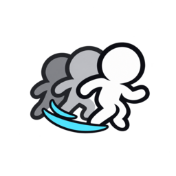 | 회피율 증가 / 회피율 증가 II | `p_evade`, `p_evadeR` |
|  | 회피 시 화살 / 회피 시 화살 II / 회피 시 화살 III | `p_arrowEv`, `p_arrowEvR`, `p_arrowEvL` |
| 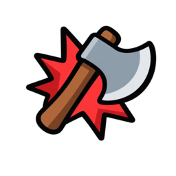 | 피격 시 도끼 / 피격 시 도끼 II / 피격 시 도끼 III | `p_axeHit`, `p_axeHitR`, `p_axeHitL` |
|  | 반격률 증가 / 반격률 증가 II | `p_counter`, `p_counterR` |
|  | 반격 시 창 | `p_spearCt` |
|  | 치명타 확률 증가 / 치명타 확률 증가 II | `p_critR`, `p_critRR` |
| 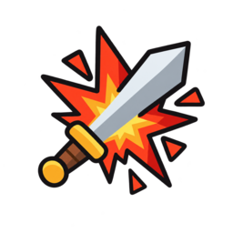 | 치명타 피해 증가 / 치명타 피해 증가 II | `p_critF`, `p_critFR` |
| 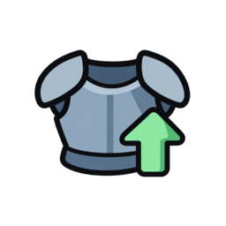 | 방어력 증가 / 방어력 증가 II / 방어력 증가 III | `p_def`, `p_defR`, `p_defL` |
| 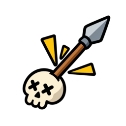 | 처치 시 창 | `p_killSpearN`, `p_killSpearR`, `p_killSpearL` |
| 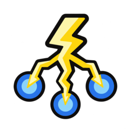 | 처치 시 번개 | `p_killBoltN`, `p_killBoltR`, `p_killBoltL` |
| 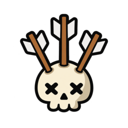 | 처치 시 화살 | `p_killArrowN`, `p_killArrowR`, `p_killArrowL` |
| 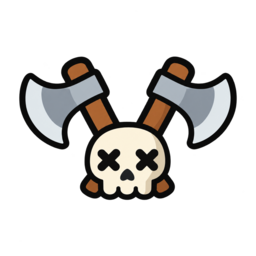 | 처치 시 도끼 | `p_killAxeN`, `p_killAxeR`, `p_killAxeL` |
| 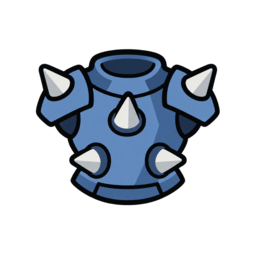 | 가시갑옷 | `p_thornsN`, `p_thornsR`, `p_thornsL` |
| 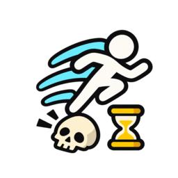 | 처치 시 회피 버프 | `p_killEvBuff` |
|  | 수집가·공격 | `p_collAtk` |
|  | 수집가·치명 | `p_collCrit` |
| 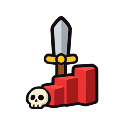 | 처치 시 공격력 스택 | `p_killAtkStk` |
|  | 처치 시 회피 스택 | `p_killEvStk` |
| 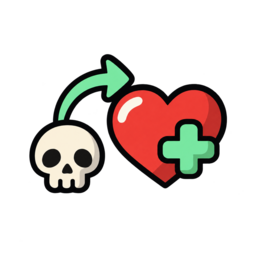 | 처치 시 회복 | `p_killHealN` |
|  | 수집가·체력 | `p_collHp` |
|  | 치명 스택 | `p_critStack` |
|  | 공격 시 공속 버프 | `p_aspdAtk` |
| 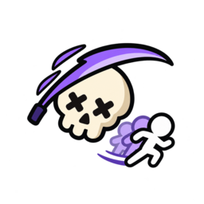 | 회피 시 즉사 / 회피 시 즉사 II / 회피 시 즉사 III | `p_execEvN`, `p_execEvR`, `p_execEvL` |
| 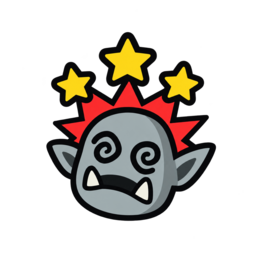 | 치명타 시 스턴 / 치명타 시 스턴 II / 치명타 시 스턴 III | `p_stunCritN`, `p_stunCritR`, `p_stunCritL` |
| 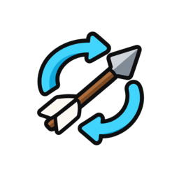 | 2타 화살 / 2타 화살 II / 2타 화살 III | `p_nArrowN`, `p_nArrowR`, `p_nArrowL` |
| 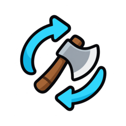 | 3타 도끼 / 3타 도끼 II / 3타 도끼 III | `p_nAxeN`, `p_nAxeR`, `p_nAxeL` |
|  | 3타 번개 / 3타 번개 II / 3타 번개 III | `p_nBoltN`, `p_nBoltR`, `p_nBoltL` |
|  | 5타 회복 | `p_nHealN` |
| 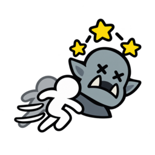 | 회피 시 스턴 | `p_evadeStun` |
|  | 반격 치명 / 반격 치명 II | `p_ctCritN`, `p_ctCritR` |
| 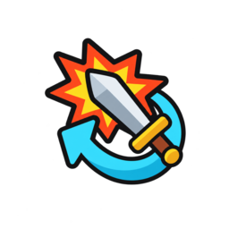 | 반격 강화 / 반격 강화 II | `p_ctDmgN`, `p_ctDmgR` |
|  | 처치 시 확정 치명 | `p_killSureCrit` |
|  | 관통 베기 / 관통 베기 II / 관통 베기 III | `p_cleaveN`, `p_cleaveR`, `p_cleaveL` |
| 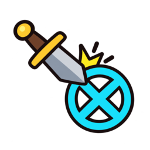 | 피해 무시 | `p_ignoreN` |
| 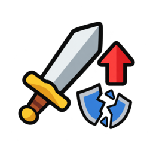 | 실드 없을 때 공격력 | `p_noShAtk` |
| 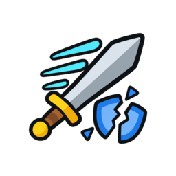 | 실드 없을 때 공속 | `p_noShAspd` |
| 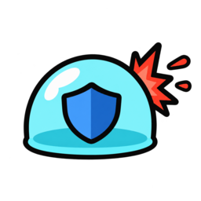 | 피격 시 방어막 / 피격 시 방어막 II / 피격 시 방어막 III | `p_wardHitN`, `p_wardHitR`, `p_wardHitL` |
| 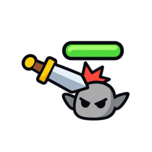 | 풀피 적 강타 | `p_fullHp` |
|  | 수리 증폭 | `p_repairUp` |
|  | 회복 증폭 | `p_healUp` |
|  | 회복 시 수리 | `p_healRepair` |
|  | 처치 시 수리 | `p_killRepair` |
| 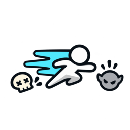 | 처치 시 대시 | `p_killDash` |
| 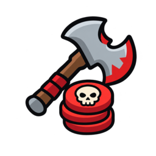 | 버서커 | `p_berserkStk` |
|  | 회피 시 수리 / 회피 시 수리 II | `p_evRepairR`, `p_evRepairL` |
|  | 치명 시 창 | `p_critSpearR`, `p_critSpearL` |
| 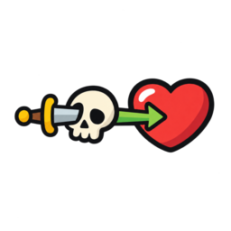 | 오버킬 회복 | `p_overkill` |
| 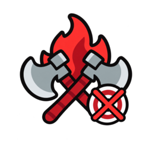 | 광전사 | `p_berserk` |
|  | 귀족의 눈 | `p_nobleEye` |
| 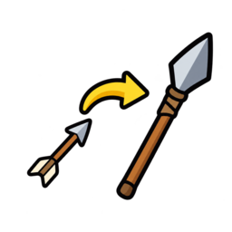 | 창의 화신 | `p_spearAvatar` |
| 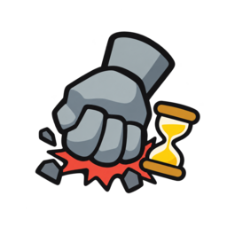 | 거인의 힘 | `p_giant` |
| 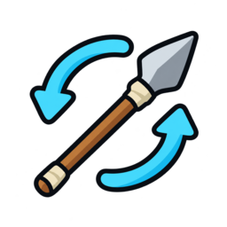 | 3타 창 | `p_nSpearL` |
| 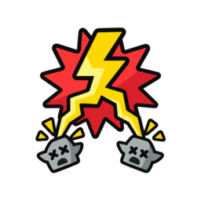 | 치명 시 번개 | `p_critBoltL` |
| 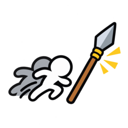 | 회피 시 창 | `p_spearEvL` |
| 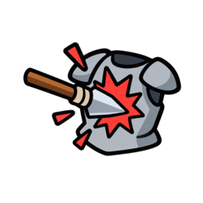 | 피격 시 창 | `p_spearHitL` |
| 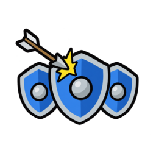 | 실드 방벽 | `p_shWallL` |
|  | 실드 반사 | `p_shRefL` |
